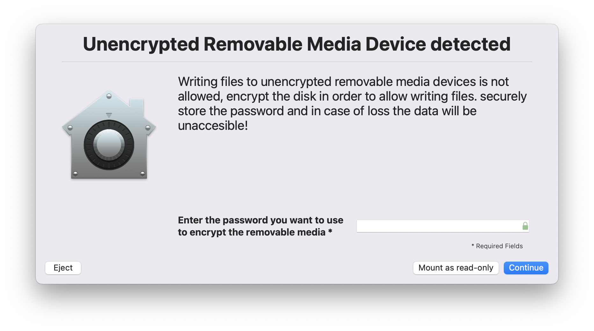
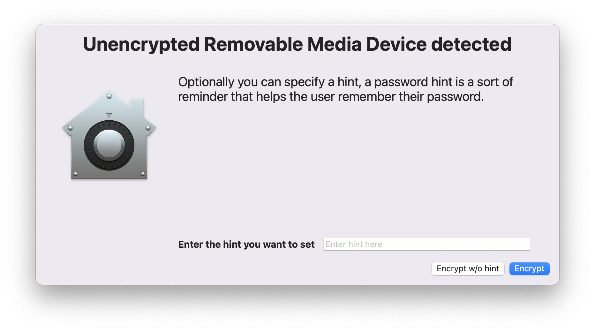
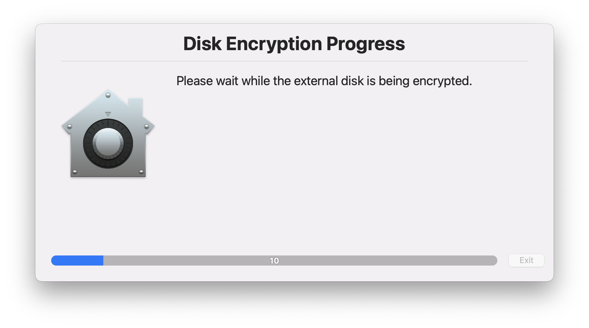
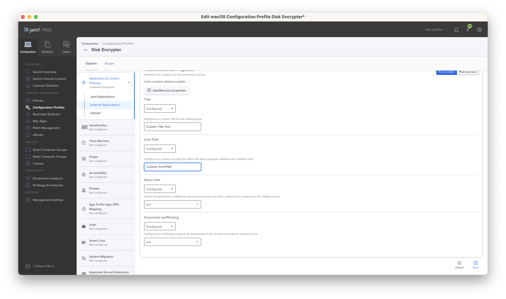

# Disk Encrypter - Encrypt unencrypted removable storage devices

This repository provides a `LaunchDaemon` based workflow using `StartOnMount` monitoring new `Volumes` being mounted on the macOS endpoint, once a new volume mount has been detected by the `LaunchDaemon` it triggers the `DiskEncrypter.sh` script to provide a end-user driven workflow to have the removable media devices encrypted or automatically mounted as `read-only`.

This workflow could help any organisation by preventing loss of corporate data on to unencrypted removable storage devices and provide guided end-users workflows to have the storage devices encrypted in an automated fashion.

Please read through and test this script intensively prior adding it to your production environment, as in some cases the end-user agree's to erase the external disk and losing it's contents stored on it.

This workflow has been tested against
- macOS Sonoma Beta 3 (23A5286g)
- macOS Monterey 12.6 (21G115)
- macOS Ventura 13.0 (22A380)

## Dependencies
The workflows relies on swiftDialog, the preference is that it is already pre-installed but within the script we do provide checks to download and install it if it's not existing on the endpoint.

- [SwiftDialog](https://github.com/bartreardon/swiftDialog/releases)
    -  swiftDialog includes options to enforce a password and hint complexity requirements based on a REGEX string which can be customised by using the `JSON` schema uploaded into Jamf Pro
	- Tested with the latest release of swiftDialog v1.X and 2.0.1

## Workflow Steps

Steps to create the workflow:

- [ ] Jamf Pro / MDM - Distribute [swiftDialog](https://github.com/bartreardon/swiftDialog/releases) to the macOS endpoints
- [ ] Jamf Pro / MDM - Upload and configure the [`JSON`](./com.custom.diskencrypter.json) schema for the Managed Preferences `com.custom.diskencrypter` in to [Jamf Pro Configuration Profiles Custon Applications & Settings](https://docs.jamf.com/technical-papers/jamf-pro/json-schema/10.26.0/JSON_Schema_Manifest_Structure.html)
- [ ] Jamf Pro / MDM - Distribute the DiskEncrypter.pkg contained in Releases
    - This distributes the script, the LaunchDaemon and loads it as well.

##  <a id="components"></a>Components
###  <a id="launchdaemon"></a>LaunchDaemon

by installing the provided package in this repository we are distributing the `com.custom.volumewatcher` `LaunchDaemon` and loading with by using `launchctl`. This `LaunchDaemon` monitors the /volumes/ folder on changes and runs the `ProgramArguments` in case changes happens.

```
<?xml version="1.0" encoding="UTF-8"?>
<!DOCTYPE plist PUBLIC "-//Apple//DTD PLIST 1.0//EN" "http://www.apple.com/DTDs/PropertyList-1.0.dtd">
<plist version="1.0">
<dict>
	<key>Label</key>
	<string>com.custom.volumewatcher</string>
	<key>OnDemand</key>
	<true/>
	<key>ProgramArguments</key>
	<array>
		<string>/bin/sh</string>
		<string>/Library/Application Support/Custom/DiskEncrypter.sh</string>
	</array>
	<key>StartOnMount</key>
	<true/>
</dict>
</plist>

```

###  <a id="script"></a>Script

On detection of a new volume being mounted in `Volumes` the `LaunchDaemon` triggers the [`DiskEncrypter.sh`](./DiskEncrypter.sh) which does the following

- Checks if the mounted volumes are external and removable
- if external and removable checks the storage type (APFS, HFS, Microsoft Basic Data)
- Based on the Volume Storage Type it checks if the volume is encrypted or not encrypted with FileVault
- In case of being not encrypted  we mount it as read-only right away to prevent loss of data and it triggers swiftDialog and generates end-user worksflows to encrypt the removable media by setting a password that does needs to match a password and hint requirement that can be configured using the JSON schema. (default 4 characters)
	- The end-user is able to mount	the disk as read-only, eject or continue with the encryption workflow
	- In case of APFS the volume is being encrypted with no loss of existing data
	- In case of HFS the volume is being converted to APFS and being encrypted with no loss of existing data
	- In case of Microsoft Basic Data (NTFS) we warn the user that we need to **erase** the disk and change the storage type to APFS and we are **losing existing content of the disk**
		- to do on this workflow is archive existing content if it does exist on the volume, erase, convert and encrypt the disk and restore existing content

###  <a id="logging"></a>Logging

DiskEncrypter writes to the macOS Unified Log, use the following command to filter the Unified Logs.

```log show --predicate 'process == "logger" AND eventMessage contains "DiskEncrypter:"'```

### Optional Workflow Components

#### Jamf Protect

- The built-in Analytic `USBInserted` can be used alongside this workflow to monitor on USB Inserted activity
- A custom Analytic can be created to monitor the LaunchDaemon being unloaded and the end-user or malicious attacker trying to bypass the provided workflows. 
    - Sensor Type: `File Event`
    - Predicate: 

###  <a id="screenshots"></a>Screenshots



<br/>

<br/>

###  <a id="credits"></a>credits

- First and foremost to bartreardon and community for developing swiftDialog
- Secondly @mvandbent reviewing and providing me with some extra idea's to add

#
#### Please note that all resources contained within this repository are provided as-is and are not officially supported.
